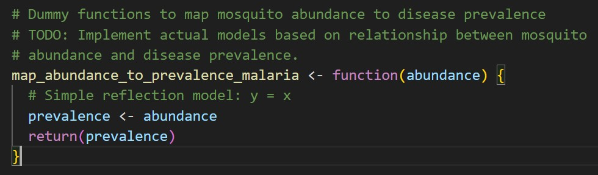
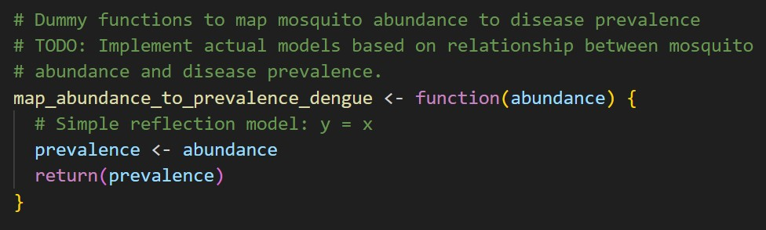
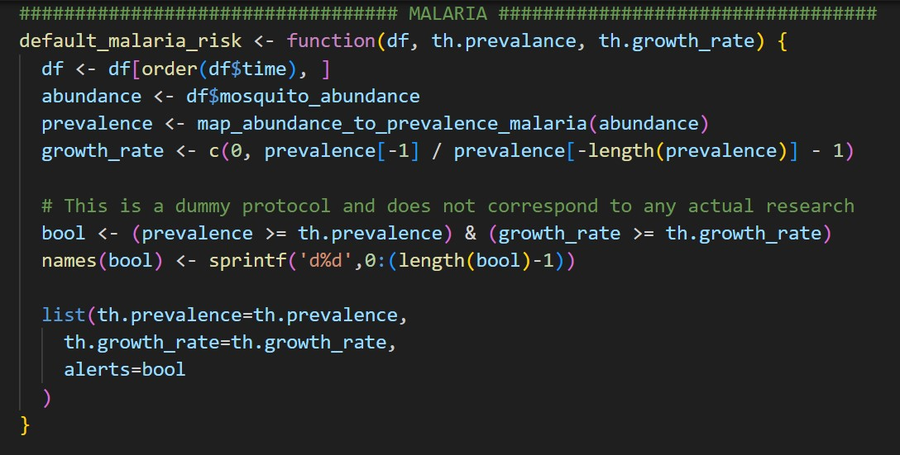
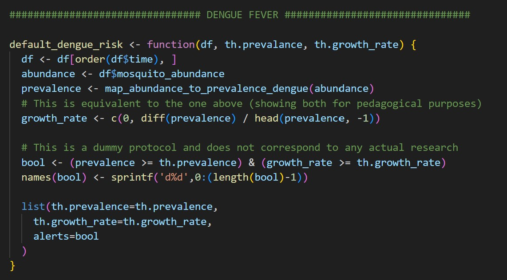
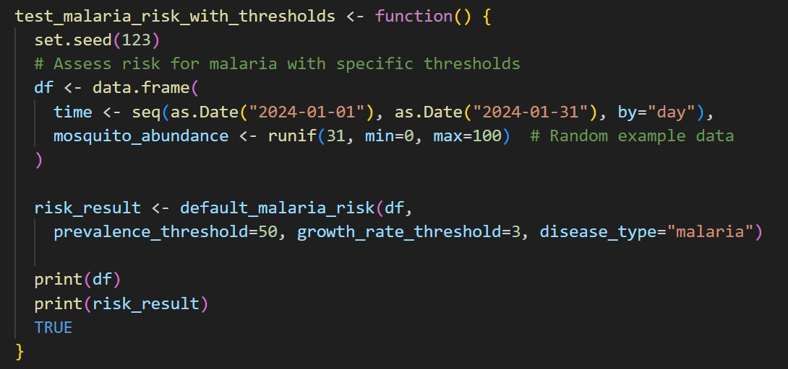
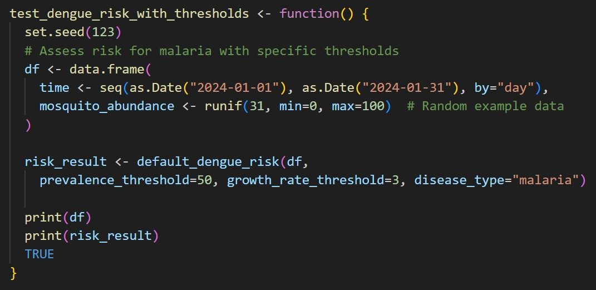

# Methodology

## Implementation Of Mosquito Abundance PDEs

## Implementation Of An LSTM Model For Mosquito Population Prediction Using The Population Data

## Validation Of PDE Model With The Observational Data

## Implementing Risk Protocol For Alerting People Of Higher Risk Of Disease Transmission

### Introduction

The primary goal of our study is to implement a risk protocol for alerting people of higher risk of disease transmission based on mosquito abundance data. This system will generate alerts when mosquito abundance reaches critical thresholds specific to malaria and dengue fever. The methodology involves determining these thresholds, implementing a risk function, testing, and deploying the system within the CADP (Community Alert and Decision Platform).

### Risk Protocol Development

#### Determine Mosquito Abundance Threshold For Malaria

- **Rationale:** Malaria transmission is heavily influenced by the density of Anopheles mosquitoes, which are the primary vectors for the disease.
- **Methodology:**
  - Review existing literature and data on malaria transmission rates and mosquito abundance.
  - Analyze historical data to identify the mosquito density associated with increased malaria cases.
  - Conduct statistical analysis to determine the threshold beyond which the risk of malaria transmission becomes significant.
```{r, echo=FALSE, fig.align='center', fig.cap="Reflection Model: Mosquito Abundance and Disease Prevalence for Malaria", out.width='70%'}        

```
  - Determining the appropriate thresholds requires field validation.
    - It is crucial to collaborate with researchers specializing in infectious diseases to obtain and analyze empirical data.
    - Such a partnership will provide the necessary insights to refine the risk models and ensure that the alert system is based on accurate, real-world data.
    
- **Hypothesis:** There exists a specific mosquito abundance threshold that significantly elevates malaria transmission risk.
- **Analysis:** Use regression models to correlate mosquito abundance with malaria incidence rates.
- **Results:** Document the identified threshold and justify its selection based on statistical significance and literature review.

#### Determine Mosquito Abundance Threshold For Dengue Fever

- **Rationale:** Dengue fever is transmitted by Aedes mosquitoes, and its incidence is linked to the abundance of these vectors.
- **Methodology:**
  - Review existing literature and data on dengue transmission rates and mosquito abundance.
  - Analyze historical data to identify the mosquito density associated with increased dengue cases.
  - Conduct statistical analysis to determine the threshold beyond which the risk of dengue transmission becomes significant.
```{r, echo=FALSE, fig.align='center', fig.cap="Reflection Model: Mosquito Abundance and Disease Prevalence for Dengue", out.width='70%'}        

```
  - Determining the appropriate thresholds requires field validation.
    - It is crucial to collaborate with researchers specializing in infectious diseases to obtain and analyze empirical data.
    - Such a partnership will provide the necessary insights to refine the risk models and ensure that the alert system is based on accurate, real-world data.
- **Hypothesis:** There exists a specific mosquito abundance threshold that significantly elevates dengue transmission risk.
- **Analysis:** Use regression models to correlate mosquito abundance with dengue incidence rates.
- **Results:** Document the identified threshold and justify its selection based on statistical significance and literature review.

### Implementing The Risk Function In R

#### Develop The Risk Function

- **Rationale:** To automate the generation of alerts based on the identified thresholds for malaria and dengue fever.
- **Methodology:**
  - Define the risk function parameters, including mosquito abundance, location, and disease type.
  - Implement the function in R, ensuring it accurately triggers alerts when thresholds are exceeded.
  
```{r, echo=FALSE, fig.align='center', fig.cap="Risk Function: Malaria", out.width='70%'}        

```
  - The default_malaria_risk function is designed to assess the risk of malaria transmission based on mosquito abundance data. The function takes three inputs: a data frame df containing time-series data, and two thresholds—th.prevalance for mosquito abundance and th.growth_rate for the growth rate of malaria prevalence. Here’s a breakdown of how the function works:
    - **Sorting Data by Time:**
        - The function first orders the input data frame df by the time column to ensure that the data is in chronological order. This is crucial for accurately calculating the growth rate over time.
    - **Mapping Mosquito Abundance to Malaria Prevalence:**
        - The function extracts mosquito abundance data from the data frame and passes it to the map_abundance_to_prevalence_malaria function. This function is a placeholder that currently returns a direct mapping of abundance to prevalence (a 1:1 relationship). The result is stored in the prevalence variable.
    - **Calculating Growth Rate:**
        - The growth rate of malaria prevalence is calculated by comparing the prevalence at each time point with the previous one. The growth rate is computed as a percentage change from the previous prevalence value. The first value is set to 0 because there’s no prior data point to compare.
    - **Generating Risk Alerts:**
        - The function then checks if the calculated prevalence and growth rate exceed the specified thresholds (th.prevalance and th.growth_rate). A Boolean vector (bool) is created, where each element indicates whether both conditions are met at each time point.
        - The elements of this vector are named using a sequence like d0, d1, etc., corresponding to the time points.
    - **Returning the Results:**
        - The function returns a list containing the prevalence threshold, growth rate threshold, and the Boolean vector of alerts. This list can be used to identify periods of high risk for malaria transmission.
        
    - **Note:** This function is a prototype and uses a dummy protocol, meaning it does not rely on actual research data. The final implementation will require field validation and collaboration with experts to develop an accurate model for mapping mosquito abundance to malaria prevalence.

```{r, echo=FALSE, fig.align='center', fig.cap="Risk Function: Dengue", out.width='70%'}        

```
  - The default_dengue_risk function is designed to evaluate the risk of dengue fever transmission based on mosquito abundance data. This function is similar to the default_malaria_risk function, with adjustments to account for the specifics of dengue fever. Here’s a detailed breakdown:
    - **Sorting Data by Time:**
      - The function begins by ordering the input data frame df by the time column to ensure that the data is processed in chronological order. This step is essential for accurately calculating the growth rate over time.
    - **Mapping Mosquito Abundance to Dengue Prevalence:**
      - The mosquito abundance data from the data frame is extracted and passed to the map_abundance_to_prevalence_dengue function. This function currently acts as a placeholder, directly mapping mosquito abundance to disease prevalence (a 1:1 relationship). The resulting prevalence data is stored in the prevalence variable.
    - **Calculating Growth Rate:**
      - The growth rate of dengue prevalence is computed as the percentage change between consecutive time points. This is done using the diff function, which calculates the difference between successive prevalence values, divided by the previous value. The first growth rate is set to 0 as there is no prior data point for comparison.
    - **Generating Risk Alerts:**
      - The function then generates a Boolean vector (bool), indicating whether both the prevalence and growth rate exceed the specified thresholds (th.prevalance and th.growth_rate). If both conditions are met at a given time point, the corresponding element in the vector is set to TRUE.
      - Each element of this vector is named according to the time points (e.g., d0, d1, etc.).
    - **Returning the Results:**
      - The function returns a list that includes the specified prevalence threshold, growth rate threshold, and the Boolean vector of alerts. This list serves as an output to identify periods of heightened dengue transmission risk.

    - **Note:** This implementation is a prototype using a dummy protocol. It does not reflect actual research data. Future development will involve field validation and collaboration with experts to create an accurate model for dengue prevalence based on mosquito abundance.

- **Analysis:** Validate the function through unit tests and simulations.
- **Results:** A functional risk algorithm capable of real-time alert generation.

#### Write Tests For The Risk Function

- **Rationale:** Ensure the risk function operates correctly and reliably under various scenarios.
- **Methodology:**
  - Develop a comprehensive test suite covering different abundance levels, locations, and disease types.
  - Use mock data to simulate different scenarios and validate the function's output.

```{r, echo=FALSE, fig.align='center', fig.cap="Testing Risk Function: Malaria", out.width='70%'}        

```

  - The test_malaria_risk_with_thresholds function is a test function designed to evaluate the performance of the default_malaria_risk function under specific thresholds for malaria risk. This function generates a sample dataset, applies the risk assessment, and prints the results. Here's a detailed breakdown:
    - **Setting a Seed for Reproducibility:**
      - The function begins by setting a random seed using set.seed(123). This ensures that the randomly generated data is reproducible, meaning that the same data will be produced each time the function is run.
    - **Creating a Sample Data Frame:**
      - A data frame df is created to simulate mosquito abundance data over a period of 31 days (from January 1, 2024, to January 31, 2024).
      - The mosquito_abundance column contains random values between 0 and 100, generated using the runif function. These values represent the mosquito abundance for each day in the time series.
    - **Assessing Malaria Risk:**
      - The function calls the default_malaria_risk function to assess the risk of malaria transmission based on the generated data. It passes the following parameters:
        - df: The data frame containing time and mosquito abundance data.
        - prevalence_threshold=50: The threshold for mosquito abundance, above which malaria prevalence is considered significant.
        - growth_rate_threshold=3: The threshold for the growth rate of malaria prevalence.
        - disease_type="malaria": Specifies the type of disease being assessed, in this case, malaria.
      - The result of the risk assessment is stored in the risk_result variable.
    - **Printing the Results:**
      - The function prints the original data frame (df) and the risk assessment results (risk_result) to the console. This allows for a visual inspection of the input data and the corresponding risk alerts generated by the function.
    - **Returning TRUE:**
      - Finally, the function returns TRUE, which is a common practice in test functions to indicate that the function has completed its execution successfully.

    - **Purpose:**
      - This test function is intended to demonstrate how the default_malaria_risk function can be applied to a dataset with specific thresholds. By generating and analyzing simulated data, the function helps validate that the risk assessment logic works as expected.

```{r, echo=FALSE, fig.align='center', fig.cap="Testing Risk Function: Dengue", out.width='70%'}        

```

  - The test_dengue_risk_with_thresholds function is a test function designed to evaluate the performance of the default_dengue_risk function under specific thresholds for assessing dengue fever risk. The function generates a sample dataset, applies the risk assessment, and prints the results. Here's a detailed breakdown:
    - **Setting a Seed for Reproducibility:**
      - The function begins by setting a random seed using set.seed(123). This ensures that the randomly generated data is consistent and reproducible each time the function is run, allowing for consistent testing.
    - **Creating a Sample Data Frame:**
      - A data frame df is created to simulate mosquito abundance data over a period of 31 days (from January 1, 2024, to January 31, 2024).
      - The mosquito_abundance column contains random values between 0 and 100, generated using the runif function. These values represent the daily mosquito abundance within the specified timeframe.
    - **Assessing Dengue Risk:**
      - The function calls the default_dengue_risk function to evaluate the risk of dengue fever transmission based on the generated data. It passes the following parameters:
        - df: The data frame containing time and mosquito abundance data.
        - prevalence_threshold=50: The threshold for mosquito abundance, above which dengue prevalence is considered significant.
        - growth_rate_threshold=3: The threshold for the growth rate of dengue prevalence.
      - The result of the risk assessment is stored in the risk_result variable.
    - **Printing the Results:**
      - The function prints the original data frame (df) and the risk assessment results (risk_result) to the console. This provides a visual output of the input data and the corresponding risk alerts generated by the function.
    - **Returning TRUE:**
      - The function concludes by returning TRUE, a common practice in test functions to signify that the function has executed successfully without errors.

    - **Purpose:**
      - The purpose of this test function is to demonstrate the application of the default_dengue_risk function using a simulated dataset with specific thresholds. It validates the function's ability to accurately assess the risk of dengue fever transmission based on mosquito abundance data.

- **Analysis:** Assess the accuracy and reliability of the risk function based on test results.
- **Results:** Document test cases, methodologies, and outcomes, highlighting any necessary adjustments.

### Deployment And Testing In CADP

#### Deploy The Risk Function

- **Rationale:** Integrate the risk function into the CADP for real-time monitoring and alerting.
- **Methodology:**
  - Collaborate with CADP developers to integrate the function.
  - Ensure seamless data flow and compatibility between the risk function and CADP.
- **Analysis:** Monitor the deployment process and address any integration issues.
- **Results:** Successful deployment of the risk function within CADP.

#### Test The System In CADP

- **Rationale:** Validate the system's performance in a live environment.
- **Methodology:**
  - Conduct end-to-end testing of the integrated system.
  - Simulate various scenarios to ensure the system triggers alerts correctly.
- **Analysis:** Evaluate system performance and reliability based on test results.
- **Results:** Document testing procedures, results, and any necessary adjustments.

### Simulation And Validation

#### Simulate For Locations With Malaria Or Dengue Fever Surveillance Data

- **Rationale:** Verify the accuracy and reliability of the alert system in real-world conditions.
- **Methodology:**
  - Select locations with historical surveillance data for malaria and dengue fever.
  - Run simulations using actual mosquito abundance and disease incidence data.
- **Analysis:** Compare the system's alerts with historical disease outbreaks.
- **Results:** Document the simulation process, outcomes, and any discrepancies.

#### Compare Triggered Alerts With Surveillance Data

- **Rationale:** Validate the system's effectiveness in predicting disease outbreaks.
- **Methodology:**
  - Analyze the correlation between triggered alerts and actual surveillance data.
  - Assess the system's predictive accuracy and reliability.
- **Analysis:** Perform statistical analysis to evaluate the system's performance.
- **Results:** Document findings, highlighting the system's strengths and areas for improvement.
